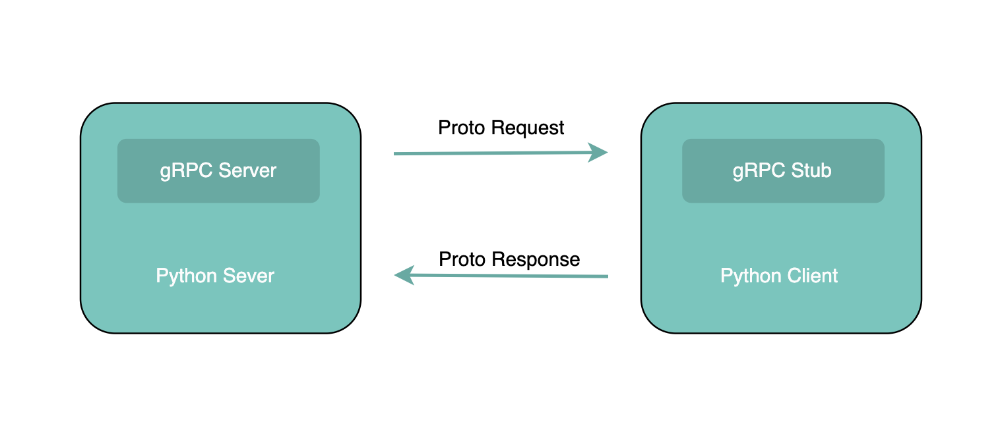

# gRPC with Python Example

This repository contains a simple example of using gRPC (gRPC Remote Procedure Calls) with Python. The example demonstrates a basic client-server application where the server adds two numbers.




## Getting Started

Follow the steps below to run the example on your local machine.

### Prerequisites

- Python (version 3.8 or higher)
- [grpcio](https://grpc.io/docs/quickstart/python/) and [grpcio-tools](https://grpc.io/docs/quickstart/python/#generate-code) installed

### Installing Dependencies

```bash
pip install grpcio grpcio-tools
```

### Running the Server
```bash
python server.py
```

### Running the Client
```bash
python client.py
```